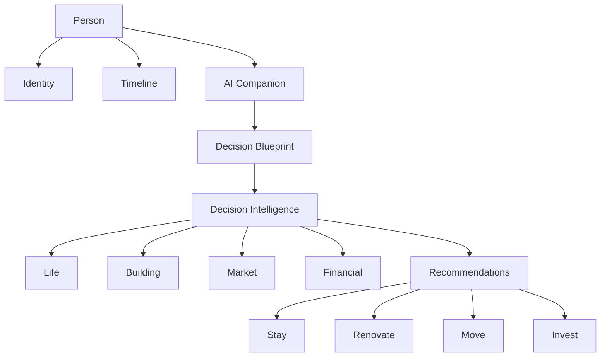

# Architecture Review — Accepted Direction

**Source:** Product / architect review of `SYSTEM-DESIGN.md`  
**Score:** 9.2 / 10  
**Status:** Accepted direction (documentation contract — not yet implemented)  
**Companion:** [`SYSTEM-DESIGN.md`](./SYSTEM-DESIGN.md)

---

## Framing

Agent Kammer is not a conventional real-estate marketing site.

It is a **Decision Intelligence Platform**, with **real estate as the first vertical**.

Advisor-first. Client-lifecycle durable. Decision OS as the permanent **life decision workspace** (not a dashboard).

---

## What’s excellent

- Clear separation of UI / AI / CRM / data
- Advisor-first philosophy consistent throughout
- Coherent user journey
- Identity ladder as a strong concept
- AI architecture thoughtfully documented
- Technical debt honestly acknowledged
- Roadmap feels grounded (not speculative sprawl)

---

## Biggest architectural improvements

### 1. Person identity (P0 — highest priority)

Today identity is fragmented across:

`visitorId` · `sessionId` · `memberId` · `leadId`

**Target:** one Customer / Person identity with aliases.

```txt
Person
 ├─ visitor ids
 ├─ browser ids
 ├─ conversations
 ├─ emails
 ├─ phones
 ├─ sessions
 └─ account
```

Everything else attaches to the Person.

### 2. Decision Graph (P1)

Keyword document retrieval will hit limits.

**Target:** relationship retrieval, not document keyword match.

```txt
Decision Graph
Person
 ↓
Goals
 ↓
Problems
 ↓
Buildings
 ↓
Neighborhoods
 ↓
Reports
 ↓
Recommendations
```

The AI should query relationships, not documents.

### 3. Decision Timeline (P0 — heart of Hub)

Biggest missing product surface. Every user should have a living spine:

```txt
Today
Current Situation
 ↓
Decision
 ↓
Options considered
 ↓
Reports
 ↓
Properties
 ↓
Offer
 ↓
Purchase
 ↓
Ownership
```

This becomes the heart of the Hub.

### 4. Elevate Building Intelligence → Decision Intelligence (P1)

**Current:** Decision + Building Intelligence (as primary intelligence brand).

**Target:**

```txt
Decision Intelligence
├── Life
├── Building
├── Market
├── Financial
├── Renovation
└── Ownership
```

### 5. Remodeling Intelligence (P1)

Long-term relationship tool.

User uploads photos → AI analyzes:

- Deferred maintenance
- ROI
- Resale impact
- Buyer perception
- Estimated cost
- Recommended order

---

## What to remove / de-emphasize

Surfaces that do not reinforce **Agent Kammer = Decision Intelligence**:

| Surface | Action |
|---------|--------|
| Travel Deals | Remove / de-emphasize from planned product surface |
| Affiliate | Remove / de-emphasize from planned product surface |
| Legacy Concierge | Keep as Legacy only; do not revive in live shell |

---

## Decision OS evolution (accepted long-term)

**Status: Planned** — accepted product direction; not Live. Prior P0/P1 priorities (Person identity, Decision Timeline, Decision Graph) nest under this evolution; they are not replaced.

### Mindset shift

> “Here’s your **life decision workspace**.”

Real estate is one major decision domain. The core identity stays Decision OS so ownership, remodeling, relocations, and adjacent domains can expand without a product rebrand. Prefer **workspace** language over **dashboard**.

### Agent Kammer Decision OS tree

```txt
Person
  ├─ Identity
  ├─ Timeline
  └─ AI Companion
       ↓
Decision Blueprint
       ↓
Decision Intelligence: Life | Building | Market | Financial
       ↓
Recommendations
       ↓
Stay | Renovate | Move | Invest
```



### Hub = life decision workspace

Permanent client hub modules (target — **Planned**, not Live):

| Module | Role |
|--------|------|
| Goals | What the Person is optimizing for |
| Decision Timeline | Living spine (heart of Hub — P0) |
| Decision Blueprint™ | Post–Discovery Call decision artifact (Situation · Key Decisions · BI Lens · How We Work · Why AK · Next Step). Aliases: Strategic Recommendation · Executive Decision Brief. **Not** a “proposal.” Spec: [`docs/product/DECISION-BLUEPRINT.md`](../product/DECISION-BLUEPRINT.md). Notion: [Guide & Recap](https://www.notion.so/39d0ad628ae581158d9dc26128a751ea) · [Template](https://www.notion.so/39d0ad628ae581dcae58c4b4bf93585a). **Planned** in Hub; human-delivered via Markdown/Notion today |
| Saved Buildings | Building shortlist |
| Neighborhoods | Place shortlist |
| Reports | Building / market / decision briefs |
| Renovation Planner | Remodeling Intelligence surface |
| Vision Board | Aspiration / direction |
| Documents | Artifacts & uploads |
| AI Advisor | Companion entry (Decision Guide evolution) |

**Client journey insert (accepted):** Decision Guide → Discovery Call → **Decision Blueprint™** → Building Intelligence / Search → …

Earlier hub tree (Identity, Timeline, Vision Board, Goals, Decision Map, …) remains valid detail under this evolution; Timeline and Person identity stay P0.

---

## Final assessment

> You’re no longer building a real estate website.
>
> You’re building a **Decision Intelligence Platform** with real estate as the first vertical.
>
> That distinction is significant—and it’s reflected in the architecture. Keep leaning into that direction.

---

## Priority contract (for roadmap)

Long-term spine: **Decision OS evolution** (above) — Status **Planned**. Person / Timeline / Graph priorities nest under it.

| Priority | Theme |
|----------|--------|
| **P0** | Unify Customer / Person identity (aliases) |
| **P0** | Decision Timeline as heart of Hub |
| **P1** | Decision Graph (relationship retrieval) |
| **P1** | Elevate Building Intelligence → Decision Intelligence |
| **P1** | Remodeling Intelligence |
| **Cleanup** | Remove / de-emphasize Travel Deals, Affiliate, Legacy Concierge from planned surface |

Live / Partial / Planned labels in `SYSTEM-DESIGN.md` remain honest — these are accepted direction, not shipped claims.

---

## Accepted ops decision — Notion-fed CRM (not SoT)

**Status: Accepted** (docs + Notion structure; sync code optional/stub)

| Layer | Role |
|-------|------|
| **Website DB** | **Source of truth** — Person identity, chat memory, analytics, automation, lead scores |
| **Notion** | **Private human admin / CRM workspace** — People, Leads/Opportunities, Conversations, Tasks |
| **`/admin`** | **Light / dev** — do not invest in a heavy admin portal for now |

- Sync direction v1: **website → Notion (one-way)** only.
- Notion is **not** the only database and must not become SoT.
- Contract: [`docs/integrations/notion-crm.md`](../integrations/notion-crm.md) · Command Center: [`docs/admin/ADMIN-COMMAND-CENTER.md`](../admin/ADMIN-COMMAND-CENTER.md).
