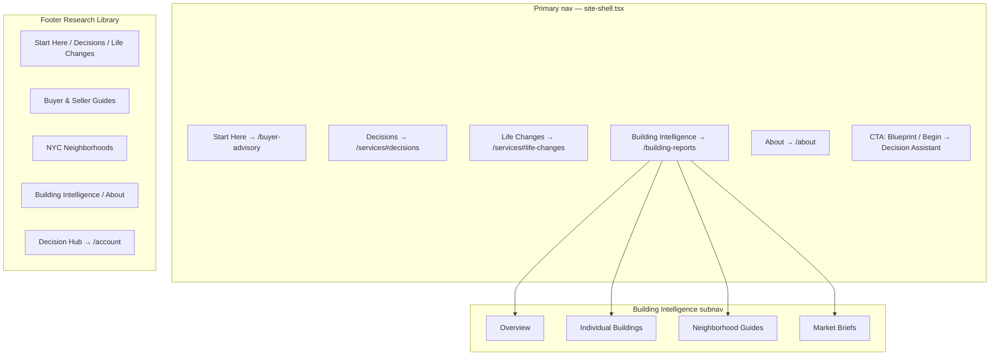
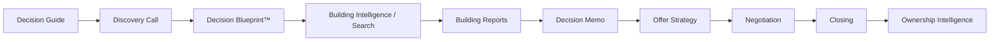
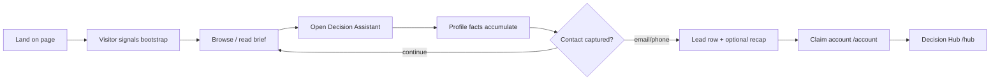
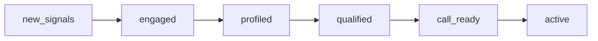
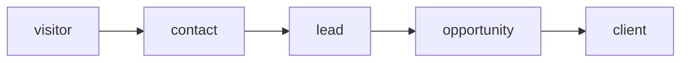
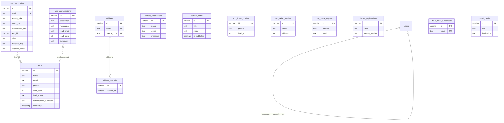
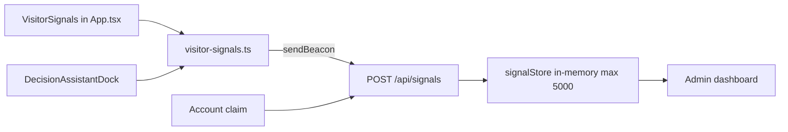

# Agent Kammer — System Design Document

**Status:** Architecture review package (accurate to current codebase)  
**Product framing:** Advisor-first Decision Intelligence Platform — real estate as the first vertical. Decision OS is a **life decision workspace** (not a conventional marketing site or dashboard).  
**Primary export:** Markdown (this file). PDF optional later via any Markdown→PDF tool.  
**Sources of truth:** `client/src/App.tsx`, `server/routes.ts`, `shared/schema.ts`, `server/storage.ts`, Decision Guide prompt/profile/knowledge, `DecisionAssistantDock`, claim-account, admin intelligence, SEO public assets.

> **Architect review (accepted direction)** — Score **9.2/10**. Contract priorities: Person identity, Decision Timeline, Decision Graph, Decision Intelligence elevation, Remodeling Intelligence; long-term **Decision OS evolution** (life decision workspace). De-emphasize Travel Deals / Affiliate / Legacy Concierge. See [`ARCHITECTURE-REVIEW.md`](./ARCHITECTURE-REVIEW.md). New concepts remain **Planned** until implemented.

**Legend:** **Live** = wired and reachable · **Partial** = schema/API/UI exists but incomplete · **Planned** = documented or stubbed, not implemented · **Legacy** = code present, not mounted in the live shell

---

## Table of contents

1. [Folder structure](#1-folder-structure)
2. [Route map](#2-route-map)
3. [Navigation hierarchy](#3-navigation-hierarchy)
4. [User journey diagrams](#4-user-journey-diagrams)
5. [AI / chat architecture](#5-ai--chat-architecture)
6. [Database schema / ER diagram](#6-database-schema--er-diagram)
7. [API endpoint list](#7-api-endpoint-list)
8. [Authentication flow](#8-authentication-flow)
9. [Admin dashboard architecture](#9-admin-dashboard-architecture)
10. [Decision Guide conversation flow](#10-decision-guide-conversation-flow)
11. [Landing page architecture](#11-landing-page-architecture)
12. [Search / SEO architecture](#12-search--seo-architecture)
13. [Analytics and event tracking](#13-analytics-and-event-tracking)
14. [Tech stack summary](#14-tech-stack-summary)
15. [Performance architecture](#15-performance-architecture)
16. [Security overview](#16-security-overview)
17. [Planned roadmap](#17-planned-roadmap)
18. [Known technical debt](#18-known-technical-debt)
19. [Architect review prompts](#architect-review-prompts)

---

## 1. Folder structure

High-level only. Current layout is a Vite + Express monorepo under `client/` / `server/` / `shared/`. Product vision folders (`features/`, `command-center/`) are emerging incrementally — see `docs/product-architecture.md`.

```txt
Agent-kammer/
├── client/                 # Vite React SPA
│   ├── public/             # sitemap, robots, llms.txt, IndexNow key, brand assets
│   └── src/
│       ├── App.tsx         # routes, shell, visitor signals, Decision Guide dock
│       ├── pages/          # route-level screens
│       ├── components/     # layout, dock, UI; command-center / decision-blueprint emerging
│       ├── features/       # decision-navigator, decision-briefs, building-intelligence
│       ├── data/           # service-landings, decision-navigation, content maps
│       ├── lib/            # visitor-signals, knowledge-graph helpers, query client
│       └── hooks/          # usePageMetadata, etc.
├── server/                 # Express app + AI/CRM routes
│   ├── routes.ts           # all HTTP APIs
│   ├── storage.ts          # MemStorage | DbStorage (Neon)
│   ├── prompts/            # Decision Guide system prompt
│   └── lib/                # claim-account, admin-intelligence, signals, knowledge
├── shared/                 # schema.ts, crm-pipeline.ts (client + server)
├── api/                    # Vercel serverless duplicates (stateless Decision Guide, etc.)
├── content/                # building reports, knowledge-graph JSON, brand copy
├── brand/                  # design assets (logo, type, photography)
├── docs/                   # product, growth, admin, this architecture package
└── archived/               # retired pages/components (not in live router)
```

| Layer | Role |
|-------|------|
| `client` | Decision OS UI, landings, hub, admin portal |
| `server` | Auth, AI turns, CRM writes, admin aggregation |
| `shared` | Drizzle schema + strategy scoring contract |
| `api/` | Edge/serverless shims for Vercel; **not** full CRM parity |
| `content/` | Portable briefs / graph data (not runtime DB) |

---

## 2. Route map

Defined in `client/src/App.tsx` (Wouter). Admin uses a stripped shell (no Header / Footer / Decision dock).

### Public pages (live)

| Path | Page | Notes |
|------|------|-------|
| `/` | Home | Decision OS entry |
| `/about` | About | |
| `/services` | Services hub | Decision brief library |
| `/services/:slug` | ServiceLanding | 28 advisor landings |
| `/building-reports` | Buildings | Building Intelligence overview |
| `/building-reports/individual-buildings` | BuildingReport | |
| `/building-reports/neighborhood-guides` | NewYorkMarket | |
| `/building-reports/market-briefs` | Intelligence | |
| `/building-reports/:slug` | BuildingReportDetail | |
| `/buyer-advisory` | Buy | “Start Here” |
| `/insights` | Perspectives | |
| `/insights/:slug` | PerspectiveArticle | |
| `/insights/reports/:slug` | ExecutiveHousingReport | |
| `/contact` | Contact | |
| `/account` | Account | Claim / create member |
| `/hub` | DecisionHub | Member Decision Hub |

### Admin (live)

| Path | Page |
|------|------|
| `/admin` | AdminPortal |
| `/admin/*` | AdminPortal (same component) |

### Member

| Path | Auth | Status |
|------|------|--------|
| `/account` | Email claim → `ak_member_token` | **Live** |
| `/hub` | Bearer / cookie token via `/api/account/hub` | **Live** |

### Key redirects (live)

| From | To |
|------|-----|
| `/buildings` | `/building-reports` |
| `/buildings/:slug/report` | `/building-reports/:slug` |
| `/buy` | `/buyer-advisory` |
| `/executive-relocation` | `/services/executive-relocation-nyc` |
| `/corporate-relocation` | `/services/corporate-relocation-buyers-nyc` |
| `/international` | `/services/foreign-buyers-new-york` |
| `/senior-downsizing` | `/services/retiree-senior-home-buyers-nyc` |
| `/school-district-planning` | `/services/school-district-planning-nyc` |
| `/military-relocation` | `/services/military-relocation-nyc` |
| `/physician-relocation` | `/services/physician-relocation-nyc` |
| `/finance-relocation` | `/services/finance-hedge-fund-relocation-nyc` |
| `/pet-friendly-moves` | `/services/pet-friendly-moves-nyc` |
| `/new-york-market` | `/building-reports/neighborhood-guides` |
| `/intelligence` | `/building-reports/market-briefs` |
| `/perspectives`, `/perspectives/*` | `/insights`, `/insights/*` |
| `/lease`, `/sell`, `/reverse-seller-architecture` | `/contact` |
| `/strategy`, `/buy-sell`, `/reverse-buyer-origination` | `/buyer-advisory` |
| `/profile` | `/account` |
| `/real-estate` | `/building-reports` |

Fallback: `NotFound`.

---

## 3. Navigation hierarchy



| Surface | Source | Behavior |
|---------|--------|----------|
| Primary | `client/src/components/site-shell.tsx` → `Header.tsx` | 5 links + opens Decision Assistant |
| Building subnav | `buildingReportsNav` + `ReportSubnav` | On Building Intelligence pages |
| Footer | `Footer.tsx` + `decision-navigation.ts` | Research Library (Browse): search + Popular Searches pills + reduced quick-link cluster |
| Services anchors | `Services.tsx` | `#frameworks`, `#decisions`, `#life-changes`, etc. |

Privacy / Terms / Licenses in the footer are **spans only** (not linked) today.

---

## 4. User journey diagrams

### Client advisory journey (canonical)

Post–Discovery Call deliverable is the **Decision Blueprint™** (aliases: Strategic Recommendation · Executive Decision Brief). Do **not** call it a “proposal.” Spec + template: [`docs/product/DECISION-BLUEPRINT.md`](../product/DECISION-BLUEPRINT.md). Notion: [Guide & Recap](https://www.notion.so/39d0ad628ae581158d9dc26128a751ea) · [Template](https://www.notion.so/39d0ad628ae581dcae58c4b4bf93585a).

```txt
Decision Guide → Discovery Call → Decision Blueprint™ → Building Intelligence / Search → …
```

Full How We Work pipeline (Blueprint §4):

```txt
Decision Guide → Discovery Call → Decision Blueprint™ → Building Intelligence™
  → Property Search → Building Reports → Decision Memo → Offer Strategy
  → Negotiation → Closing → Ownership Intelligence
```



### Anonymous visitor → Decision Guide → claim → Hub



### Advisor pipeline (admin view)



Stages computed at request time in `shared/crm-pipeline.ts` + `admin-intelligence.ts` — **not** persisted as `pipeline_opportunities` rows yet.

### Identity ladder (product model)



Business truth belongs in Postgres; PostHog (planned) stays behavioral telemetry only.

**Accepted direction (Planned):** collapse runtime IDs (`visitorId` / `sessionId` / `memberId` / `leadId`) into one **Person** with aliases — see roadmap P0 and [`ARCHITECTURE-REVIEW.md`](./ARCHITECTURE-REVIEW.md).

### Future Decision OS hub (accepted direction — Planned)

**Hub = life decision workspace**, not a dashboard. Mindset: “Here’s your life decision workspace” — real estate is one major decision domain; room to expand ownership, remodeling, relocations, and adjacent domains without changing core identity.

**Not Live** — current `/hub` is an MVP snapshot. Full contract: [`ARCHITECTURE-REVIEW.md` → Decision OS evolution](./ARCHITECTURE-REVIEW.md#decision-os-evolution-accepted-long-term).

```txt
Person
  ├─ Identity
  ├─ Timeline          ← heart of Hub (P0)
  └─ AI Companion
       ↓
Decision Blueprint
       ↓
Decision Intelligence: Life | Building | Market | Financial
       ↓
Recommendations
       ↓
Stay | Renovate | Move | Invest
```

```mermaid
flowchart TB
  P[Person]
  P --> I[Identity]
  P --> T[Timeline]
  P --> AI[AI Companion]
  AI --> BP[Decision Blueprint]
  BP --> DI[Decision Intelligence]
  DI --> Rec[Recommendations]
  Rec --> Out[Stay | Renovate | Move | Invest]
```

**Hub modules (Planned):** Goals · Decision Timeline · **Decision Blueprint™** (post–Discovery Call decision artifact; not a proposal — see [`DECISION-BLUEPRINT.md`](../product/DECISION-BLUEPRINT.md)) · Saved Buildings · Neighborhoods · Reports · Renovation Planner · Vision Board · Documents · AI Advisor.

Prior Person / Timeline / Graph priorities nest under this evolution (unchanged P0/P1).

---

## 5. AI / chat architecture

Agent Kammer’s live companion is the **Decision Guide** (“Raphi”), not the legacy luxury concierge.

### Systems overview

| System | Entry | Status |
|--------|-------|--------|
| Decision Guide | `DecisionAssistantDock` → `POST /api/decision-guide/chat` | **Live** |
| Conversation autosave | `GET/POST /api/decision-assistant/conversation` | **Live** |
| Legacy concierge | `POST /api/chat` + `FloatingChatAssistant` | **Legacy** (API exists; dock not mounted in `App.tsx`) |
| Vercel serverless Decision Guide | `api/decision-guide/chat.ts` | **Partial** — AI only, no DB/CRM |

### Prompt flow (live)

```mermaid
sequenceDiagram
  participant UI as DecisionAssistantDock
  participant API as /api/decision-guide/chat
  participant KB as decision-guide-knowledge
  participant LLM as OpenAI / xAI
  participant DB as chat_conversations + leads

  UI->>UI: Rule-based step reply (immediate)
  UI->>API: message + pageContext + profile
  API->>API: Cookie ak_visitor_id
  API->>DB: Load memory by visitorId
  API->>KB: Keyword retrieve (9 static docs)
  API->>LLM: System prompt + JSON schema
  LLM-->>API: reply, profile, actions, leadQualification
  API->>DB: Persist summary JSON; createLead if contact new
  API-->>UI: applyAiGuideTurn (may override UI)
```

**Model selection:** `DECISION_GUIDE_MODEL` \|\| `OPENAI_MODEL` \|\| `grok-4.3` (xAI) / `gpt-4o-mini`.

**Knowledge:** `server/lib/decision-guide-knowledge.ts` — token overlap + `core` authority boost. **Not** vector RAG. **Planned:** Decision Graph relationship retrieval (see §17 / review).

**Structured profile:** `server/lib/decision-guide-profile.ts` — belief fields with `{ value, confidence, source, lastUpdated }` (situation, desire, constraints, tradeOff, timeline, budget, financing, geography, buildings viewed, etc.).

### Memory model (important)

| Layer | Key | Storage |
|-------|-----|---------|
| Client session | `localStorage` `akDecisionAssistantSessionId` | `chat_conversations.sessionId` via decision-assistant API |
| AI server memory | Cookie `ak_visitor_id` | Same table, keyed by **visitorId** |

Two IDs can produce **two conversation rows** unless claim-account merges them. Account claim explicitly resolves visitor + assistant + signal session IDs.

### Lead scoring (three layers)

| Layer | Where | Visible to visitor? |
|-------|-------|---------------------|
| Client heuristic | `scoreLead()` / `classifyLead()` in dock | No (internal) |
| AI qualification | `leadQualification` in model JSON | No (prompt forbids UI display) |
| Strategy score | `computeStrategyScore()` in `crm-pipeline.ts` | Admin only |

### CRM integration

| Action | Status |
|--------|--------|
| Create `leads` on first email/phone in Decision Guide | **Live** |
| Client `sendRecap` → `POST /api/leads` + optional briefs | **Live** |
| Append recommendation brief to member hub | **Live** when member linked |
| Telegram/email `notifyLead` | **Live** for legacy `/api/chat` + some forms; **not** wired for Decision Guide createLead |
| External CRM sync | **Planned** / none |
| Persist `visitor_profiles` / `lead_signal_events` / `pipeline_opportunities` | **Schema only** |

### AI actions returned to UI

`open_page` · `recommend_page` · `update_blueprint` · `send_recap` · `none`

---

## 6. Database schema / ER diagram

**ORM:** Drizzle (`shared/schema.ts`).  
**Runtime:** `DbStorage` when `DATABASE_URL` set (Neon serverless); else `MemStorage` (`server/storage.ts`).

### Live / storage-backed tables



### CRM OS tables — schema defined, not used by storage (**Partial / Planned**)

| Table | Intent |
|-------|--------|
| `visitor_profiles` | Durable visitor identity + attribution |
| `lead_signal_events` | Persistent signal log (today: in-memory `signalStore`) |
| `pipeline_opportunities` | Persisted pipeline rows (today: computed on read) |

### Soft relationships (application-level)

- `member_profiles.visitorIds[]` / `conversationIds[]` link anonymous sessions after claim  
- Admin merges people by email → phone → sessionId → id  
- No formal FKs between leads, conversations, and opportunities yet

---

## 7. API endpoint list

From `server/routes.ts`. Auth: **Public** · **Member token** · **Admin Basic**.

### Decision Guide & chat

| Method | Path | Auth | Status |
|--------|------|------|--------|
| POST | `/api/decision-guide/chat` | Public (+ visitor cookie) | **Live** |
| GET | `/api/decision-assistant/conversation/:sessionId` | Public | **Live** |
| POST | `/api/decision-assistant/conversation` | Public | **Live** |
| POST | `/api/chat` | Public | **Legacy** |

### Leads, signals, account

| Method | Path | Auth | Status |
|--------|------|------|--------|
| POST | `/api/leads` | Public | **Live** |
| GET | `/api/leads` | Public* | **Live** (review exposure) |
| POST | `/api/signals` | Public | **Live** (in-memory) |
| POST | `/api/account/claim` | Public | **Live** |
| GET | `/api/account/hub` | Member | **Live** |
| POST | `/api/account/briefs` | Member / auto-claim | **Live** |

### Admin

| Method | Path | Auth |
|--------|------|------|
| GET | `/api/admin/session` | Admin |
| GET | `/api/admin/dashboard` | Admin |
| GET | `/api/admin/pipeline` | Admin |
| GET | `/api/admin/rbo-profiles` | Admin |
| GET | `/api/chat-conversations` | Admin |
| DELETE | `/api/chat-conversations/:id` | Admin |
| GET | `/api/affiliates` | Admin |
| GET | `/api/travel-deals/subscribers` | Admin |
| POST | `/api/travel-deals` | Admin |

### Content & media

| Method | Path | Auth |
|--------|------|------|
| GET/POST | `/api/content` | Public write* |
| GET | `/api/content/stage/:stage` | Public |
| PATCH/DELETE | `/api/content/:id` | Public* |
| GET | `/api/media-center` (+ format/slug variants) | Public |

\*Several content and lead GETs lack `requireAdmin` — treat as **debt** (see §18).

### Forms & products

| Method | Path | Notes |
|--------|------|-------|
| POST | `/api/contact` | Contact form |
| POST | `/api/home-value` | Home value request |
| POST | `/api/broker-registration` | Broker signup |
| POST | `/api/rbo/profile` | Reverse buyer origination |
| POST | `/api/rso/profile` | Reverse seller |
| POST | `/api/affiliates` | Affiliate signup |
| POST | `/api/audiobook-sample` | Lead magnet |
| POST | `/api/market-report` | Report generation |
| GET | `/api/market-data/:region` | Market data |
| POST/GET | `/api/travel-deals/*` | Travel deals + subscribe |

### Vercel `api/` shims

Present under `/api/decision-guide`, `/api/decision-assistant`, `/api/contact`, `/api/leads` — **not** guaranteed to share Express storage/CRM behavior. Prefer Express `server/routes.ts` as the architecture source of truth for full Decision OS.

---

## 8. Authentication flow

### Member account claim (**Live**)

```mermaid
sequenceDiagram
  participant U as Visitor
  participant Acc as /account
  participant API as POST /api/account/claim
  participant CA as claim-account.ts
  participant DB as member_profiles + leads

  U->>Acc: Submit email
  Acc->>API: email + session ids
  API->>CA: claimVisitorToMember()
  CA->>CA: Resolve conversations by visitorId / assistantSession / signalSession
  CA->>DB: Upsert member_profiles (accessToken akm_*)
  CA->>DB: Seed brief; link/create lead; contact_submissions audit
  API-->>Acc: Set httpOnly ak_member_token + hub snapshot
  Acc->>U: Navigate /hub
```

- **No password.** Opaque `accessToken` + httpOnly cookie.  
- Hub: `GET /api/account/hub` accepts Bearer or cookie.  
- Google button on Account page: toast only + signal `account_google_intent` — **Planned**.  
- Schema comment: Google / magic link attach later — **Planned**.  
- `users` table (username/password): **unused** by Decision Hub.

### Admin Basic Auth (**Live**)

- Env: `ADMIN_USER`, `ADMIN_PASS` (503 if unset).  
- Client stores `Basic …` in `sessionStorage` (`ak_admin_basic`).  
- Middleware: `requireAdmin` on admin APIs.  
- `X-Robots-Tag: noindex` on `/admin` and `/api/admin/*`.  
- Docs note local defaults when unset in non-production — production must set env vars.

---

## 9. Admin dashboard architecture

```txt
AdminPortal.tsx
  → Basic auth
  → GET /api/admin/dashboard
  → buildAdminDashboard(storage, { signals: signalStore.all() })
  → Merge leads + contacts + conversations + RBO + in-memory signals
  → computeStrategyScore + derivePipelineStage
  → Tabs: Pipeline | Funnel | Signals | People
```

| Capability | Status |
|------------|--------|
| Kanban pipeline (6 stages) | **Live** (computed) |
| Today panels (high-intent, returning, follow-ups, …) | **Live** |
| Funnel Source → … → Client | **Live** |
| Strategy score bands + top signals | **Live** |
| Write / stage mutation from UI | **Not implemented** (read-only) |
| Persisted `pipeline_opportunities` | **Planned** |
| Durable signal history across restarts | **Planned** (in-memory today) |

Supporting modules: `server/lib/admin-intelligence.ts`, `shared/crm-pipeline.ts`, `docs/admin-portal.md`.

---

## 10. Decision Guide conversation flow

Hybrid client: **rule-based script first**, AI turn overlays asynchronously.

```txt
1. Mount dock → load conversation by localStorage sessionId
2. Route change → navigation memory + page context (knowledge-graph helpers)
3. User message → immediate scripted step (situation → desire → constraints → trade-off)
4. Parallel POST /api/decision-guide/chat → structured JSON turn
5. applyAiGuideTurn may update reply, profile, actions
6. Debounced POST /api/decision-assistant/conversation (client session persistence)
7. Contact capture paths:
   - Regex email/phone → sendRecap → /api/leads (+ briefs)
   - AI first contact → server createLead(leadSource: decision_guide)
   - AI action send_recap → member brief
   - /account claim → merge all sessions into member_profiles
```

**Page awareness:** `getPageContext(location)` feeds the model.  
**Blueprint updates:** via action `update_blueprint` + member `decisionMap` / briefs after claim.  
**Qualification:** never shown in chat UI; surfaces in admin / internal recap copy.

---

## 11. Landing page architecture

| Piece | Path | Status |
|-------|------|--------|
| Data | `client/src/data/service-landings.ts` | **Live** — 28 entries |
| Page | `client/src/pages/ServiceLanding.tsx` | **Live** |
| Route | `/services/:slug` | **Live** |
| Hub | `Services.tsx` + `decision-navigation.ts` | **Live** |

### Composition (each landing)

1. `PageHero` — title, summary, art variant, search-term kicker  
2. Who It Helps  
3. Decision Questions (4)  
4. Manhattan Lenses (considerations)  
5. What Usually Matters (`depthNotes`, optional)  
6. Decision Path (4-step)  
7. More Briefs → `/services`  
8. CTA → contact  
9. `usePageMetadata` + JSON-LD (`Service`, `BreadcrumbList`, `FAQPage`)

### Slugs (all live)

`foreign-buyers-new-york`, `pied-a-terre-buyers-nyc`, `widow-home-sales-nyc`, `1031-exchange-new-york`, `new-development-nyc`, `single-women-buying-apartment-nyc`, `female-doctors-professionals-buying-nyc`, `corporate-relocation-buyers-nyc`, `rent-vs-buy-manhattan-relocation`, `executive-relocation-nyc`, `school-district-planning-nyc`, `military-relocation-nyc`, `physician-relocation-nyc`, `finance-hedge-fund-relocation-nyc`, `condo-vs-coop-foreign-buyers-nyc`, `pet-friendly-moves-nyc`, `divorce-property-sales-nyc`, `probate-estate-sales-nyc`, `pre-foreclosure-financial-distress-sales-nyc`, `empty-nester-downsizing-nyc`, `retiree-senior-home-buyers-nyc`, `townhouse-buyers-nyc`, `upper-west-side-buyers-nyc`, `upper-east-side-buyers-nyc`, `tribeca-buyers-nyc`, `chelsea-buyers-nyc`, `hudson-yards-buyers-nyc`, `financial-district-buyers-nyc`

Legacy short paths redirect into these slugs (see §2).

---

## 12. Search / SEO architecture

Advisor-first discoverability: clear URLs, curated machine summaries, structured data on decision landings — not keyword stuffing.

| Asset | Location | Status |
|-------|----------|--------|
| Sitemap | `client/public/sitemap.xml` | **Live** (~54 URLs; manual) |
| robots.txt | `client/public/robots.txt` | **Live** — Allow `/`; Disallow `/admin` |
| llms.txt | `client/public/llms.txt` | **Live** — curated LLM summary |
| IndexNow key | `client/public/d5a9b3c50f6b3fb158d4199f78bfb805.txt` | **Live** key file; submission is **ops/manual** |
| Page meta / OG / canonical | `usePageMetadata.ts` | **Live** |
| JSON-LD | Service landings (Service + Breadcrumb + FAQ) | **Live**; other page types sparse |
| Admin noindex | routes + AdminPortal | **Live** |
| Auto sitemap generator | — | **Planned** / not in `package.json` |

`vercel.json`: SPA rewrite to `index.html`; API passthrough. No custom SEO headers beyond app/server tags.

---

## 13. Analytics and event tracking

### Visitor signals (**Live**, ephemeral server store)



| Signal type | Emitted today? |
|-------------|----------------|
| `page_view`, `returning_visit`, `social_referral`, `organic_referral`, `direct` | Yes |
| `decision_guide_open`, `decision_guide_message` | Yes |
| `email_capture` | Yes (Account + claim) |
| `account_google_intent` | Yes (custom; not in `SIGNAL_TYPES`) |
| `profile_fact`, `report_view`, `building_view`, `phone_capture`, `contact_submit`, `call_request`, `high_intent_phrase` | Defined for scoring; **not fully wired** from all surfaces |

**PostHog:** mentioned in comments/docs only — **Planned**.  
**Postgres `lead_signal_events`:** schema ready — **Planned** (swap noted in `signal-store.ts`).

Scoring weights live in `SIGNAL_SCORE_WEIGHTS` (`shared/crm-pipeline.ts`).

---

## 14. Tech stack summary

| Layer | Choice |
|-------|--------|
| UI | React 18, Wouter, TanStack Query, Radix UI, Tailwind, Framer Motion |
| Fonts | Newsreader / Cormorant / Inter (Fontsource + Google preconnect) |
| Build | Vite 5 → `dist/public`; esbuild server bundle |
| Server | Express 4, TypeScript (`tsx` / Node) |
| Data | Drizzle ORM + Zod; Neon (`@neondatabase/serverless`) or MemStorage |
| AI | OpenAI SDK (Responses API); configurable xAI / OpenAI models |
| Notify | Telegram bot API, Nodemailer / Resend |
| Deploy | Vercel (`vercel.json` SPA + API rewrites) |
| Auth | Admin Basic; Member opaque token cookie (**not** Supabase Auth yet) |
| PDF | Puppeteer (market report paths) |

---

## 15. Performance architecture

| Mechanism | Status |
|-----------|--------|
| `React.lazy` all page routes + `Suspense` | **Live** |
| Admin shell omits Header/Footer/Dock | **Live** |
| Vite code-split by dynamic import | **Live** (no custom `manualChunks`) |
| Vercel CDN for static assets | **Live** (platform default) |
| Explicit Cache-Control / edge cache rules | **Not configured** |
| Service worker / offline | **None** |
| Hero art mostly inline SVG | **Live** (fewer image requests) |
| Font preconnect in `index.html` | **Live** |

Bottlenecks to watch: Decision Guide LLM latency (hybrid rule-based reply hides TTFB), in-memory signal store size, Puppeteer report generation on server.

---

## 16. Security overview

| Area | Current posture |
|------|-----------------|
| Admin | HTTP Basic over HTTPS (assumed at edge); credentials in env; sessionStorage client copy |
| Member | Opaque bearer/cookie; no password hashing path for Hub |
| Visitor ID | Cookie `ak_visitor_id` for memory continuity |
| PII | Leads, chats, phones, emails in Postgres/MemStorage; summaries may contain profile JSON |
| Admin indexing | robots Disallow + `X-Robots-Tag` + not in sitemap |
| Public APIs | Several write/list endpoints lack auth (content CRUD, GET leads) — **risk** |
| AI | System prompt constrains disclosure; lead scores hidden from visitor UI |
| Secrets | `.env` / `.env.local` (gitignored); never commit keys |
| CSRF | Classic SPA + cookie member token — review cookie flags (`httpOnly` set on claim; SameSite/secure should be verified per deploy) |
| Serverless `api/` | Stateless AI without CRM — avoid treating as secure CRM boundary |

---

## 17. Planned roadmap

Priorities below encode the accepted architect review ([`ARCHITECTURE-REVIEW.md`](./ARCHITECTURE-REVIEW.md)). Status labels stay honest: new concepts are **Planned** until shipped. Supporting work still grounded in code + product docs (`product-architecture.md`, `behavior-system.md`, `admin-portal.md`).

### Accepted direction (priority order)

Long-term product spine: **Decision OS evolution** ([review](./ARCHITECTURE-REVIEW.md#decision-os-evolution-accepted-long-term)) — Person → Identity / Timeline / AI Companion → Decision Blueprint → Decision Intelligence (Life | Building | Market | Financial) → Recommendations → Stay | Renovate | Move | Invest. Hub framing: **life decision workspace**. Status: **Planned** (not Live). P0/P1 below nest under that evolution.

| Priority | Theme | Direction | Status |
|----------|-------|-----------|--------|
| **P0** | Person identity | Unify Customer / Person with aliases for visitor / session / member / lead; everything attaches to Person | **Planned** |
| **P0** | Decision Timeline | Living spine (situation → decision → options → reports → properties → offer → purchase → ownership) as heart of Hub | **Planned** |
| **P1** | Decision Graph | Relationship retrieval (Person → Goals → Problems → Buildings → Neighborhoods → Reports → Recommendations) vs keyword docs | **Planned** (today: keyword **Partial**) |
| **P1** | Decision Intelligence | Elevate Building Intelligence → Decision Intelligence (Life / Building / Market / Financial; Renovation / Ownership as expansion) | **Planned** (Building Intelligence **Live**) |
| **P1** | Remodeling Intelligence | Photo → deferred maintenance / ROI / resale / cost / recommended order; long-term relationship tool | **Planned** |
| **Cleanup** | Surface focus | Remove or de-emphasize Travel Deals, Affiliate, Legacy Concierge from planned product surface | **Cleanup** (Legacy / APIs may still exist) |

### Accepted ops decision — Notion-fed CRM

**Accepted:** Website DB remains **source of truth** (identity, chat memory, analytics, automation). Notion is the **private human admin / CRM workspace**. Skip heavy `/admin` portal investment; keep `/admin` light/dev.

| Layer | Role | Status |
|-------|------|--------|
| Website capture DB | SoT for Person / leads / conversations / scores | **Live** |
| Notion CRM Command Center | Human triage (People, Leads, Conversations, Tasks, Buildings, Briefs) | **Live** (Notion schema); sync **Planned** |
| `/admin` | Light diagnostics / pipeline peek | **Live** (do not expand into full CRM OS) |
| Sync | website → Notion one-way | **Planned** (no-op stub OK without keys) |

Contract: [`docs/integrations/notion-crm.md`](../integrations/notion-crm.md) · [`docs/admin/ADMIN-COMMAND-CENTER.md`](../admin/ADMIN-COMMAND-CENTER.md) · review note in [`ARCHITECTURE-REVIEW.md`](./ARCHITECTURE-REVIEW.md#accepted-ops-decision--notion-fed-crm-not-sot).

### Supporting / ongoing

| Theme | Items | Status |
|-------|-------|--------|
| Decision Hub | Life decision workspace modules (Goals, Timeline, Blueprint, Saved Buildings, Neighborhoods, Reports, Renovation Planner, Vision Board, Documents, AI Advisor); Timeline-first | **Live** MVP → deepen (**Planned** Decision OS tree) |
| Auth | Google sign-in, magic link; Supabase Auth / Postgres | **Planned** |
| CRM OS | Wire `visitor_profiles`, `lead_signal_events`, `pipeline_opportunities` under Person; human CRM in Notion | **Planned** / **Partial** |
| Notion CRM sync | One-way website → Notion Person + Conversation + Opportunity | **Planned** |
| Signals | Persist to Postgres; emit building/report/contact signals | **Partial** |
| Telemetry | PostHog for funnels/replay (not CRM truth) | **Planned** |
| Knowledge | Typed graph → Decision Graph path above | **Partial** → **Planned** target |
| Behavior system | Page awareness, blueprint growth, living cards (10 behaviors) | Vision / incremental |
| Decision Brief pattern | `features/decision-briefs/[brief]/` content modules | Target structure |
| Notifications | Decision Guide lead → Telegram/email parity | Gap to close |
| SEO ops | Auto sitemap; IndexNow submit on publish | **Planned** |
| Unify deploy | Single AI path (Express vs `api/` serverless) with shared persistence | Debt |

---

## 18. Known technical debt

1. **Identity fragmentation** — `visitorId` / `sessionId` / `memberId` / `leadId` are not yet one Person with aliases; dual conversation keys (`sessionId` vs cookie `visitorId`) can fork memory until claim merges. Aligns with review **P0**.  
2. **Keyword knowledge retrieval** — Decision Guide uses token-overlap docs, not relationship queries; will hit limits before Decision Graph. Aligns with review **P1**.  
3. **CRM OS tables unused** — schema ahead of storage/admin write path.  
4. **In-memory signals** — lost on restart; admin “today” incomplete across instances.  
5. **Vercel `api/decision-guide`** — AI without DB/CRM; drift from Express prompt modules.  
6. **Legacy `/api/chat` + FloatingChatAssistant** — still in tree; not in live shell (de-emphasize; do not revive).  
7. **Unauthenticated content / lead GETs** — tighten before multi-tenant or public abuse.  
8. **Decision Guide createLead without notifyLead** — ops may miss high-intent chats.  
9. **Incomplete signal coverage** — scoring weights exist for events not emitted.  
10. **Manual sitemap / llms.txt** — can drift from 28 landings + insights.  
11. **Footer legal links** — non-navigable spans.  
12. **Passport / users table** — present in deps/schema; unused by Hub auth model.  
13. **Travel deals / affiliate / RBO surfaces** — APIs exist; remove or de-emphasize from planned Decision Intelligence surface (review cleanup).  
14. **No pipeline write-back** — admin cannot move stage; opportunities not durable.  
15. **MemStorage in preview** — behavior differs from Neon production (easy to mis-test auth/CRM).  
16. **No Decision Timeline spine** — Hub MVP lacks the living situation→ownership timeline (review **P0** product gap).

---

## Architect review prompts

Use these lenses when reviewing this package or the running system. Prefer evidence from live code over aspiration docs.

### Scalability

- What happens when signal volume exceeds 5k or multiple serverless instances?  
- Should conversation memory and signals be the first tables forced onto Neon in all environments?  
- Is keyword knowledge retrieval enough until graph-backed retrieval ships?

### AI architecture

- Is the hybrid rule-based + AI overlay the right long-term UX, or does it fight the model?  
- Should `api/` serverless and Express share one prompt/knowledge module and one persistence path?  
- How should blueprint actions and page opens be audited for advisor quality?

### Data model

- When do we promote soft links (email match) to real FKs on the identity ladder?  
- Are `member_profiles.briefs` / `decision_map` as JSON text sustainable vs normalized tables?  
- Which CRM OS table should be wired first: signals, visitors, or opportunities?

### Visitor lifecycle

- How do we guarantee one conversation spine across browse → chat → claim → return visit?  
- What is the expiry / consent story for `ak_visitor_id` and member tokens?

### CRM intelligence

- Is strategy scoring calibrated against real closed clients, or only heuristics?  
- Should Decision Guide leads alert Telegram immediately?  
- Does admin need write actions (stage, owner, next action) before PostHog?

### SEO

- Is the Decision Brief / service landing set the right canonical inventory for sitemap + llms.txt?  
- Where should JSON-LD expand beyond service landings without turning pages into keyword farms?

### Security

- Which public POST/GET endpoints should move behind admin or rate limits first?  
- Are cookie flags and Basic auth over the public internet acceptable until Supabase Auth?

### Performance

- What is acceptable Decision Guide latency with the hybrid immediate reply?  
- Do we need edge caching headers for static decision content?

### Match to Agent Kammer Decision Intelligence vision

- Does the first viewport and nav still read as Decision OS / life decision workspace rather than a brokerage brochure or generic dashboard?  
- Are Building Intelligence and service landings feeding the Companion, or living as parallel SEO sites?  
- Is the roadmap still leaning into Person → Timeline / Companion → Blueprint → Decision Intelligence → Recommendations (Stay | Renovate | Move | Invest), or drifting into non-core surfaces (Travel / Affiliate / Legacy Concierge)?  
- Which of Behavior 001–010 are live today, and which are the next three to implement?

---

*End of System Design Document. Accepted direction: [`ARCHITECTURE-REVIEW.md`](./ARCHITECTURE-REVIEW.md). Companion interactive overview may be opened beside chat when provided as a Cursor Canvas.*
